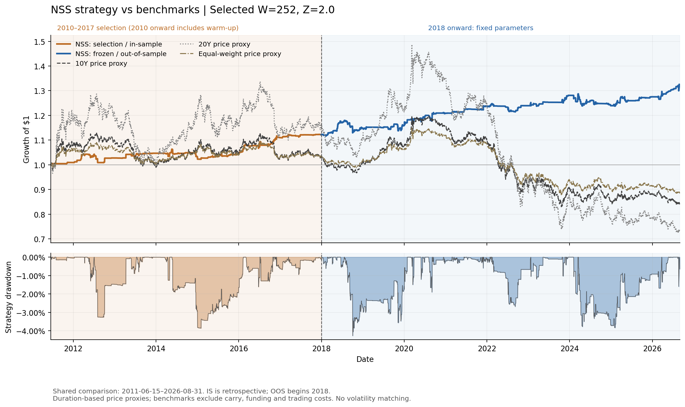
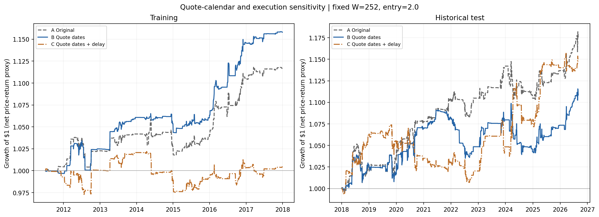

# U.S. Treasury NSS Rich–Cheap Research

**A reproducible fixed-income learning project: curve fitting, residual-based trading signals, and the limits of a historical backtest.**

Can unusually large deviations from a daily Nelson–Siegel–Svensson (NSS) yield-curve fit identify favorable subsequent yield moves? This project builds that hypothesis into a research pipeline, then tests how much the result depends on parameter selection, quote-calendar treatment, directional exposure, and execution timing.

The strategy is a **yield-based research prototype**, not an executable Treasury bond or futures strategy. Its most useful finding is that a positive baseline result becomes less convincing once modeling and timing assumptions are examined.

[Research notebook](notebooks/treasury_nss_research.ipynb) · [Methodology](docs/METHODOLOGY.md) · [Results and figures](docs/RESULTS.md) · [Limitations](docs/LIMITATIONS.md) · [Reproduction guide](docs/REPRODUCIBILITY.md)

## What the project does

| Step | Research task | Why it matters |
|---|---|---|
| 1 | Load ten FRED Treasury constant-maturity series, 3M–30Y | Establish the yield-curve inputs and audit missing observations |
| 2 | Fit a six-parameter NSS curve separately each day | Create a smooth reference curve and market-minus-model residuals |
| 3 | Standardize each maturity's residual with a rolling window | Identify deviations relative to that bucket's recent residual history |
| 4 | Select the window and entry threshold using 2010–2017 only | Keep the initial parameter search separate from later evaluation |
| 5 | Freeze the rule and evaluate 2018–2026 | Measure historical generalization with approximate costs and benchmarks |
| 6 | Reconstruct extreme-day PnL and delay all target changes | Understand return drivers and timing sensitivity |
| 7 | Remove dates without quotes, refit, and repeat the timing audit | Test whether the original calendar treatment changes the conclusion |

Daily NSS calibration estimates curve parameters. The training search selects **trading hyperparameters**; these are different operations. The baseline selects `window=252`, `entry_z=2.0`, with at most two buckets per side and gross target exposure of 1.0.

## Backtest: selection period and historical test



*Orange: the selected rule viewed in-sample after a common warm-up. Blue: the same frozen rule from 2018 onward. The initial 2010 observations are warm-up; the plotted comparison begins near the training scoring start, not at the beginning of 2010. Benchmarks are gross price-return proxies and are not risk matched.*

The supplied baseline test, through **2026-08-31**, reports **17.42% cumulative net return, 1.87% CAGR, 0.62 Sharpe versus zero, and −4.27% maximum drawdown**. These are proxy returns under the stated model, not realized investment performance.

## The important countercheck

The quote-calendar audit holds the selected parameters fixed. It uses a common training start of 2011-07-06 and actual observations per year for Sharpe and volatility; the baseline report above uses 252. The resulting A Sharpe is therefore slightly different.

| Historical test variant | Net total return | Net CAGR | Sharpe vs zero | Max drawdown |
|---|---:|---:|---:|---:|
| A — original forward-filled calendar | 17.42% | 1.87% | 0.6342 | −4.27% |
| B — valid quote dates | 10.84% | 1.19% | 0.4070 | −5.40% |
| C — valid quote dates + one-observation delay | 14.76% | 1.60% | 0.4821 | −6.24% |

Source: [calendar audit table](reports/tables/calendar_summary.csv). A starts on 2018-01-01; B/C start on the first valid quote date, 2018-01-02. All end on 2026-08-31. The final year is partial.



The delayed quote-date variant improves test CAGR relative to B, but its training CAGR falls from **2.29% to 0.07%**. No timing variant wins consistently across periods. The project does **not** select C because its test return is higher.

## What the evidence supports—and what it does not

- A complete workflow from raw yield data to frozen-rule historical evaluation and inspectable PnL attribution.
- A concrete data-quality finding: 178 all-missing rows on the baseline date index; target positions changed on seven of those rows.
- A risk finding: many extreme gains and losses are single-sided exposures to long maturities. Inverse-duration weights do not make the portfolio DV01 neutral.
- A robustness finding: calendar cleaning and execution assumptions materially change performance. Positive returns do not establish tradable relative-value alpha.

The model uses approximate duration/convexity price returns, illustrative costs and no carry or financing. Its “future” configuration selects a cost schedule; it does not use futures prices. The historical test has been repeatedly inspected during research, so later diagnostics are exploratory. Read the [limitations](docs/LIMITATIONS.md) before interpreting the results.

## Run the project

Python **3.12.7** is the reference environment. From the repository root:

```bash
python -m venv .venv
source .venv/bin/activate
python -m pip install -r requirements.txt
python src/run_research.py
```

The default run uses the versioned raw FRED snapshot, performs the full workflow, and exports tables and figures under `reports/`. It may take several minutes because NSS is fitted separately across the entire history on two calendars. It does not place trades.

To open the notebook, install `jupyterlab` and run `jupyter lab notebooks/treasury_nss_research.ipynb`. For offline checks:

```bash
python -m unittest discover -s tests -v
```

See the [reproduction guide](docs/REPRODUCIBILITY.md) for the recorded environment, explicit data refresh, output units and validation status.

## Repository map

```text
notebooks/treasury_nss_research.ipynb  # English narrative and research outputs
src/treasury_rich_cheap_nss.py        # NSS, signals, backtest and audit functions
src/research_io.py                   # Snapshot adapter and evidence exports
src/run_research.py                  # Headless end-to-end reproduction
src/download_data.py                 # Explicit raw FRED snapshot download
data/                               # Raw observations and retrieval metadata
reports/figures/                     # Backtest and model-diagnostic charts
reports/tables/                      # Metrics, holdings, returns and audit tables
docs/                               # Methods, results, limitations and reproduction
tests/                              # Offline accounting, timing and input checks
```

## Data sources

Treasury yield series are retrieved from [FRED](https://fred.stlouisfed.org/series/DGS10), sourced to the Board of Governors' H.15 release. These are daily yields in percent, not individual security prices. The [Treasury yield-curve methodology](https://home.treasury.gov/policy-issues/financing-the-government/interest-rate-statistics/treasury-yield-curve-methodology) explains the construction of constant-maturity curve data. All ten series and the snapshot hash are recorded in [data metadata](data/fred_yields_raw.metadata.json).

This revision is based on `NSS_latest.before_cleanup.ipynb`. The [provenance record](reports/provenance.json) identifies that source and the translation checks. Earlier repository versions remain available in Git history.
