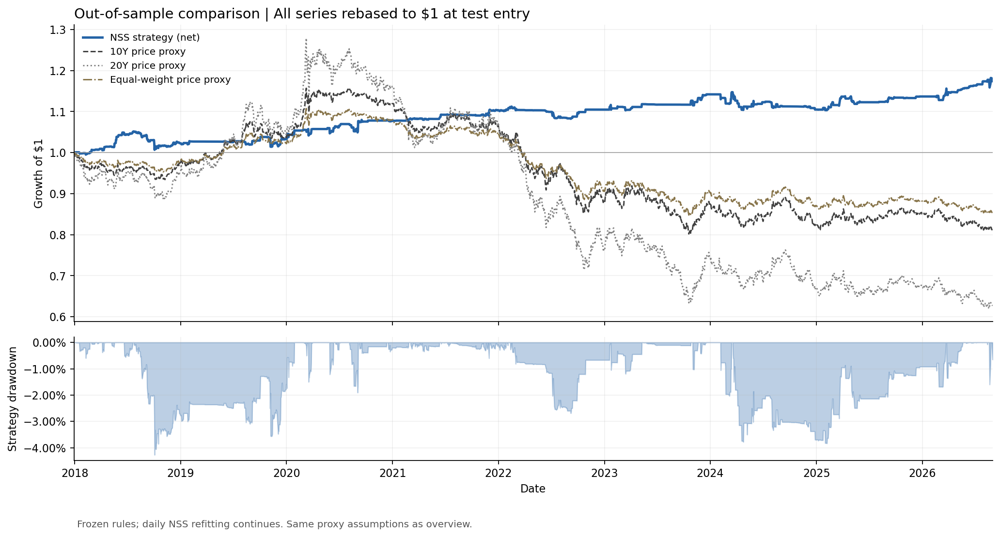
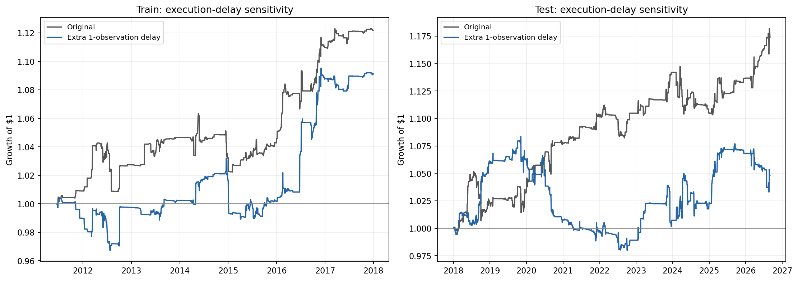
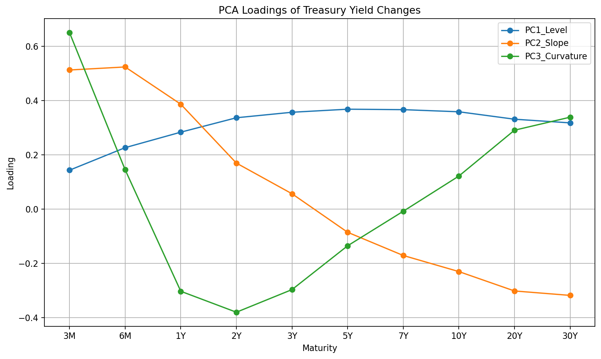
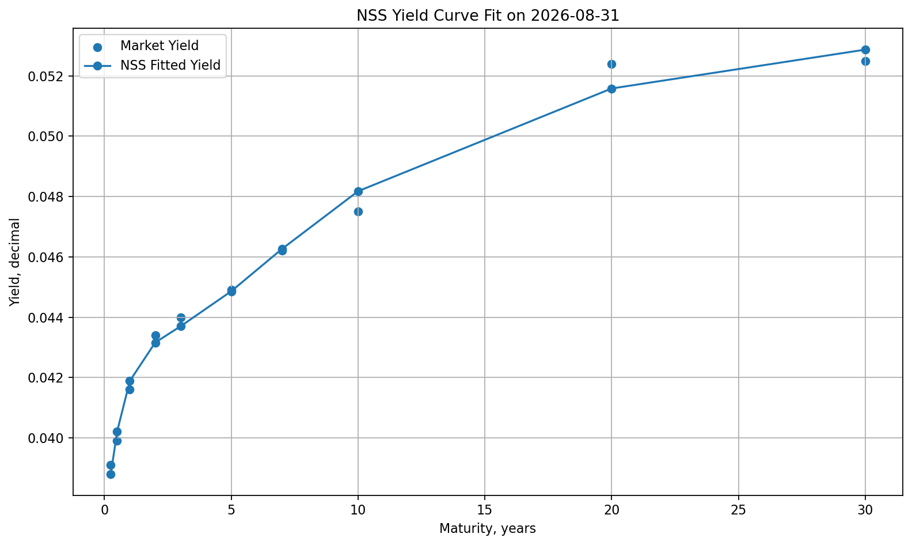

# Results and figure guide

## Scope of the evidence

The source notebook ends on 2026-08-31. The English project reproduces the same fixed-rule experiments; it does not introduce a new parameter search based on their test results. Daily returns are synthetic price-return proxies, and all Sharpe values are measured against zero.

The tables under `reports/tables/` are the numerical evidence. Figures show the same research outputs. The source notebook hash and validation record are in [provenance](../reports/provenance.json).

## 1. Training selection and baseline evaluation

The supplied training selection chooses W=252, entry=2.0 out of nine candidates. The common legacy scoring start is 2011-06-16; earlier data only warm up the model.

| Period | Net total return | CAGR | Annual volatility | Sharpe vs zero | Max drawdown |
|---|---:|---:|---:|---:|---:|
| Training, selected rule | 12.17% | 1.77% | 2.34% | 0.7359 | −3.86% |
| Historical test, 2018–2026 | 17.42% | 1.87% | 2.94% | 0.6235 | −4.27% |

Source: [baseline period performance](../reports/tables/baseline_period_performance.csv). This table uses 252 observations per year for Sharpe/volatility. The training row is a selected in-sample result, not prospective performance.

The net strategy and gross passive proxies share dates. Their risks differ, so apparent outperformance does not isolate alpha. Orange and blue distinguish parameter selection from the historical test; the first 2010 observations are not shown as scored returns.

The test-only plot rebases all series to one before the first scored test return. The lower panel shows drawdowns. The final year is incomplete. Year-by-year values are available in [annual returns](../reports/tables/baseline_annual_returns.csv).

## 2. Extreme-day reconstruction

On 2020-09-04, the baseline held a −100% 30Y target from the preceding signal date. The yield rose from 1.34% to 1.46%. With the assumed duration of 20, linear proxy PnL is `−(−1) × 20 × 0.0012 = +2.40%`; the small convexity term brings gross return to approximately 2.39968%.

On 2019-11-07, a +100% 20Y position faced an 11 bp yield rise. Its duration of 15 produces approximately −1.65% gross return. Both examples reconcile the implementation; neither verifies an executable bond return.

All ten best test days in this baseline are single-sided 20Y or 30Y exposures. Nine of the ten worst test days are single-sided. This highlights directional duration risk. See [extreme dates](../reports/tables/extreme_days.csv) and [maturity-level details](../reports/tables/extreme_maturity_details.csv). The signal date is the target-formation date, not necessarily the first date of the holding episode.

## 3. Legacy-calendar execution delay

An extra legacy-calendar observation of delay reduces test CAGR from 1.87% to 0.55%, reduces Sharpe from 0.6235 to 0.1794, and worsens drawdown from −4.27% to −9.57%. Annualized cost is approximately unchanged. This initially suggests timing sensitivity, but it must be read alongside the quote-date audit below.

All target changes, including exits, are delayed. The experiment does not establish that entry signals have exactly one day of useful life or prove a look-ahead error. Source: [legacy delay summary](../reports/tables/legacy_delay_summary.csv).

## 4. Quote-calendar audit

The baseline date index contains 4,346 rows, including 178 rows missing every maturity before forward fill. Seven of those rows have target changes in the legacy strategy. There are no partially missing maturity rows and no failed fits in the reported quote-date recalibration.

The raw file requested from 2010-01-01 has **4,347 rows and 179 all-missing rows** because it also includes the leading 2010-01-01 row. The baseline drops that unfillable leading row and begins on January 4. This explains the one-row difference between raw metadata and the audit table.

| Period | Variant | Net CAGR | Sharpe vs zero | Max drawdown |
|---|---|---:|---:|---:|
| Training | A — original | 1.71% | 0.7240 | −3.86% |
| Training | B — quote dates | 2.29% | 1.0520 | −3.31% |
| Training | C — quote dates + delay | 0.07% | 0.0459 | −4.55% |
| Test | A — original | 1.87% | 0.6342 | −4.27% |
| Test | B — quote dates | 1.19% | 0.4070 | −5.40% |
| Test | C — quote dates + delay | 1.60% | 0.4821 | −6.24% |

Source: [calendar comparison](../reports/tables/calendar_summary.csv). Training starts on 2011-07-06 for all three variants. A's test includes the filled January 1 row; B/C begin on January 2. This audit uses actual observations per year, so A's Sharpe differs from the baseline table above.

Quote-date cleaning improves the training result but weakens the test. Delay nearly eliminates training net return, yet improves test CAGR relative to B while worsening drawdown. Therefore **“delay destroys the signal” is not a stable conclusion across calendars and periods**.

A→B changes daily fitting paths, rolling statistics, targets and costs. It cannot be attributed entirely to the seven no-quote rebalances. C is not promoted to a final strategy because it happens to improve test return.

## 5. Model diagnostics

The first three components account for approximately 93.42% of standardized daily yield-change variance. This is a full-sample descriptive result, not a forecasting accuracy measure or a daily statistic. Component signs are arbitrary; loadings are not returns or direct basis-point sensitivities.

The curve snapshot illustrates the daily fit. Good visual fit does not validate the trading interpretation of a small residual.

## Research conclusion

The project produces an inspectable positive baseline backtest, but risk exposures and data/execution assumptions materially affect its interpretation. It has not established stable, tradable relative-value alpha. The next defensible task is residual and optimization stability analysis, not another test-driven search for a better Sharpe.
